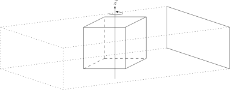

# Acquisition geometry specification


# Specification

We specify acquisition geometries using a [TOML](https://github.com/toml-lang/toml/blob/master/versions/en/toml-v0.4.0.md) file. A minimal example is given here:

```toml
specifies = "geometry"
type = "parallel"
dimension = 3
projection-file-pattern = "projection-*.tiff"

[parameters]
source-position = [-10.0, 5.0, 5.0]
detector-position = [20.0, 5.0, 5.0]
detector-tilt = [[0.0, 1.0, 0.0], [0.0, 0.0, 1.0]]
detector-size = [10.0, 10.0]
detector-shape = [256, 256]
projection-count = 10
# angles: [0, 0.5, 1.0, ...]
# ...

# optional
[volume]
min-point = [0.0, 0.0, 0.0]
max-point = [10.0, 10.0, 10.0]

# optional
[experiment]
unit-length = 1.0 # the physical coordinates are given in meters
source-voltage = 1.0
power = 1.0
filter-material = 1.0
```

The geometry specs have the following structure: first there is a *header*, the *parameters* for the geometry are given, then (optionally) the *volume* is defined, and finally additional *experimental information* may be given.

## Header

- It is specified that the file is a geometry specification, to distinguish it from other specifications:

    ```toml
    specifies = "geometry"
    ```

- The *type* (or *class*) of the geometry is specified as:

    ```toml
    class = "name"
    ```

    Where `name` is one of the following:
    - `parallel`
    - `dual-axis-parallel`
    - `cone-beam`
    - `fan-beam`
    - `laminography`
    - `tomosynthesis`
    - `trajectory`

- The problem dimension is given as:

    ```toml
    dimension = 3
    ```

- The pattern for the projection file names is given, e.g.:

    ```toml
    projection-file-pattern = "projection-*.tiff"
    ```

In what follows, we will refer to the dimension as `D`. The complete header looks like e.g.:

For 3D parallel beam:

```toml
specifies = "geometry"
type = "parallel"
dimension = 3
```

For 2D fan beam:

```toml
specifies = "geometry"
type = "fan-beam"
dimension = 2
```

etc.

## Parameters

Next a table of parameters are given. These depend on the geometry and are outlined below.

### General

The following parameters are used by multiple geometries:

- `source-position`: an array of `D` floating point numbers. The (initial) position of the source in physical coordinates.
- `detector-position`: an array of `D` floating point numbers. The  (initial) position of the center of the detector in physical coordinates.
- `detector-tilt`: an array of two arrays of `D` floating point numbers. The (initial) axes of the detector.
- `detector-size`: an array of `D - 1` floating point numbers. The physical size of the detector.
- `detector-shape`: an array of `D - 1` integers. The number of pixels on the detector.
- `projection-count`: an integer. The number of projections.

### Parallel

<p align="center">

</p>

The parallel geometry defines a parallel beam setup where the object is rotated along the physical z-axis.

- (optional) `angles`: a explicit list of floating point numbers. The rotation angle for each projection. If `angles` is not defined, then it is assumed to be a list of equidistant angles in the interval `[0, pi)`.

### Cone-beam

The cone-beam geometry defines a parallel beam setup where the object is rotated along the physical z-axis.

## Volume

After the geometry parameters, optionally a *volume* table is given. This defines a bounding box of the object that has been scanned.

The table has *two* entries:
- `min-point`: an array of `D` floating point numbers. The minimum point in physical coordinates.
- `max-point`: an array of `D` floating point numbers. The maximum point in physical coordinates.

Say `min-point` is equal to `(x_1, y_1, z_1)` and `max-point` is equal to `(x_2, y_2, z_2)`. Then:
- we require `x_2 > x_1`, `y_2 > y_1`, `z_2 > z_1`
- the bounding box fo the volume is `[x_1, x_2] x [y_1, y_2] x [z_1, z_2]`.

A valid volume definition is e.g.:

```toml
[volume]
min-point = [0.0, 0.0, 0.0]
max-point = [10.0, 10.0, 10.0]
```

This defines a volume of physical size `10 x 10 x 10`, in the *positive octant* in physical coordinates.

## Experiment

Finally, an optional table that describes the experimental setup is given. Here, the values are in SI units. E.g.:

```toml
[experiment]
unit-length = 1.0 # the physical coordinates are given in meters
source-voltage = 1.0
power = 1.0
filter-material = 1.0
```
